Freelance developer from Fürth, Germany. 👋 I build web software and run the servers it lives on.

## About

Self-employed since 2022, mostly in JavaScript and TypeScript, with a soft spot for the operations side. I like taking an idea all the way to a running service: writing it, deploying it, then keeping it healthy once real people depend on it. Most of my public code these days orbits Fluxer, a Discord-style platform I write bots and audio infrastructure for.

Reach me at rainer@schnittert.com, or see the client side of my work at [software-schnittert.com](https://software-schnittert.com).

## Currently

Building out Vinto, a self-hosted music bot for Fluxer, and the voice stack around it. My homelab (Proxmox, Gitea, Drone CI) is the backbone everything gets deployed onto.

## Public projects

[Vinto-Music](https://github.com/invaliduser231/Vinto-Music) is a self-hosted music bot for Fluxer. It plays from YouTube, SoundCloud, Deezer and radio, mirrors metadata from Spotify and Apple Music, and keeps queues, history and taste data in MongoDB. It ships `/healthz`, `/readyz` and Prometheus metrics, because I actually run it in production. TypeScript, MIT.

[NodeLink](https://github.com/invaliduser231/NodeLink), a Node.js alternative to LavaLink for voice playback. My fork tracks the audio backend Vinto depends on.

[Uptimer](https://github.com/invaliduser231/Uptimer), a small Fluxer bot that tracks how long you have been online.

[awesome-fluxer](https://github.com/invaliduser231/awesome-fluxer), the community list of Fluxer projects, libraries and tooling.

[crab-rave-timer](https://github.com/invaliduser231/crab-rave-timer), a tiny Node script that starts Crab Rave so the drop lands exactly at midnight. Yes, really.

## Also in progress

Cofyndr, a matching platform for founders, investors and talent. Client sites such as Rohr-Helden24 and Genusswerk. A pile of Fluxer tooling (a listing portal, uptime, a Lavalink deployment) that is not public yet, plus the odd C++ project for microcontrollers.

## Stack

  
  
  
  
  
  
  
  
  

Day to day that means TypeScript and Node.js, Next.js or Angular on the front, and PostgreSQL, MongoDB and Redis for data. Java and Spring Boot when a job calls for it, a bit of C++ for microcontrollers. Docker, Terraform, Traefik and Proxmox hold it all together, and I self-host my CI on Gitea and Drone.

## Stats

